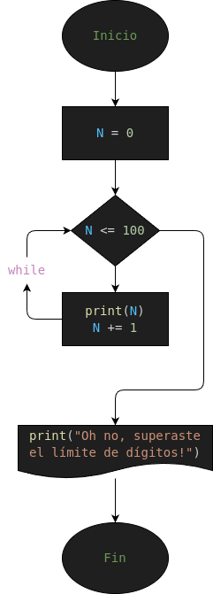

# COMANDO "WHILE"
repositorio sencillo para explicar como usar el comando while en python

### PARA QUE SIRVE?
- el comando while se usa para generar una respuesta infinitamente hasta que la condicion determinada sea falsa

### Diseño :3

## Autores del proyecto :3
